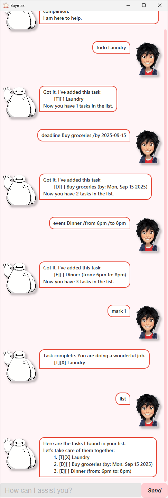

# Baymax Chatbot - User Guide 



_**Hello! I am Baymax, your personal chatbot companion. I am here to help.**_

Baymax is a friendly, text-based chatbot that helps you remember things you need to do, deadlines to meet 
and events you scheduled. 

He helps you manage tasks such as todos, deadlines, and events - all with his caring and understanding personality! 

Interact with Baymax using simple text commands, and he will respond in his signature style.

## Add a Todo

Add a simple task without any date or time.

**Usage:** `todo <description>`

**Example:** `todo Laundry`
```
Got it. I've added this task:
    [T][ ] Laundry
Now you have 1 tasks in the list.
```

## Add a Deadline

Add a task that has a due date.

**Usage:** `deadline <description> /by <yyyy-mm-dd>`

**Example:** `deadline Buy groceries /by 2025-09-15`
```
Got it. I've added this task:
    [D][ ] Buy groceries (by: Mon, Sep 15 2025)
Now you have 2 tasks in the list.
```

## Add an Event

Add a task that has a start and end time.

**Usage:** `event <description> /from <start> /to <end>`

**Example:** `event Dinner /from 6pm /to 8pm`
```
Got it. I've added this task:
    [D][ ] Dinner (from: 6pm to: 8pm)
Now you have 3 tasks in the list.
```

## Find Tasks by Keyword

Search for tasks that contain a given keyword.

**Usage:** `find <keyword>`

**Example:** `find Dinner`
```
I have scanned your list and found these tasks for you:
    1. [E][ ] Dinner (from: 6pm to: 8pm)
```

## Mark a Task as Done

Mark a task in the list as completed.

**Usage:** `mark <index>`

**Example:** `mark 1`
```
Task complete. You are doing a wonderful job.
    [T][X] Laundry
```

## Unmark a Task

Unmark a task, setting it back to incomplete.

**Usage:** `unmark <index>`

**Example:** `unmark 1`
```
I have unmarked this task.
    [T][ ] Laundry
```

## Delete a Task

Remove a task completely from the list.

**Usage:** `delete <index>`

**Example:** `delete 2`
```
Noted. I've removed this task:
    [D][ ] Buy groceries (by: Mon, Sep 15 2025)
Now you have 2 tasks in the list.
```

## List All Tasks

View all tasks currently in your list.

**Usage:** `list`

```
Here are the tasks I found in your list.
Let's take care of them together.
    1. [T][ ] Laundry
    2. [E][ ] Dinner (from: 6pm to: 8pm)
```

## Exit the Program

End the session with Baymax.

**Usage:** `bye`

```
I will deactivate now. I hope you are satisfied with my care.
```

## Notes

- Dates must be entered in the format `yyyy-mm-dd`.
- Task indices start at `1` (not `0`).
- Baymax is here to help - if your input is invalid, he will let you know in his polite way.